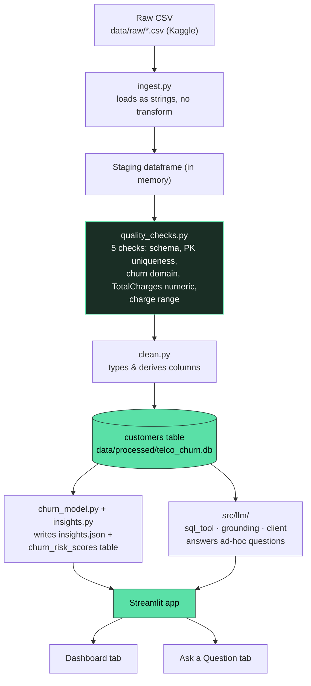

# Architecture Document: Telco Customer Churn Analytics MVP

## 1. Problem statement

Business users want to know why customers churn, which segments are riskiest, and they'd rather ask a follow-up question in plain language than write SQL themselves. This MVP covers a narrow but complete slice of that: ingest a churn dataset, build an analytics-ready layer, surface a handful of checked business insights, and let people ask natural-language questions that get answered strictly from that data, not from whatever the underlying LLM happens to know.

## 2. Architecture diagram

## 3. Data flow

Raw CSV goes to a staging dataframe (raw strings, validated), then to a cleaned/curated table with typed and derived columns, ending in the analytics-ready SQLite database. This is the heavier of the two flows the brief describes (raw, staging, transform, curated), done with plain pandas rather than a scheduler or DAG tool, since the source is one static file and an orchestrator would just be overhead here.

Quality checks run on the staging dataframe before cleaning, and the results get written to `data/processed/quality_report.json` so a failure is visible rather than quietly patched. The one check that's expected to fail, the 11 blank `TotalCharges` rows on brand-new tenure=0 customers, is handled in `clean.py` instead of dropped, so churn stats don't end up skewed toward longer-tenure customers.

Three things read from the curated table:

1. `insights.py` runs 7 fixed SQL aggregates plus one query against the model's output, and stores both the raw result and a short narrative per insight in `insights.json`. This feeds the dashboard and is also what the LLM grounding layer reaches for first.
2. `churn_model.py` is the baseline predictive model, run between the DB build and the insights step (see section 5a).
3. `grounding.py` handles questions the precomputed insights don't cover, through a constrained text-to-SQL step (section 6).

## 4. Technology choices and trade-offs

| Choice | Why | Trade-off |
|---|---|---|
| Pandas for ingestion and cleaning | 7K rows doesn't need Spark or dbt | Won't scale to large or streaming data without rework |
| SQLite as the analytics-ready store | Zero ops, file-based, but still gives the LLM a real SQL surface instead of just a dataframe | Not safe for concurrent multi-user writes, fine for a read-mostly MVP |
| Streamlit for the UI | Fastest way to a dashboard plus a prompt box in Python | Limited customization, acceptable since the brief discourages polishing the UI anyway |
| Precomputed insights as the default grounding source | Numbers get validated once by a readable query and reused, so the LLM isn't inventing aggregates each time | Only covers the questions chosen in advance; anything novel falls back to live text-to-SQL |
| Constrained text-to-SQL for novel questions | Still grounded since the LLM only sees the schema and retrieved rows, never gets to answer freely | One-shot generation, no self-correction; a bad query is reported as unanswerable rather than retried |
| Provider-agnostic `src/llm/client.py` (OpenAI by default, Anthropic/Gemini/Ollama optional) | Doesn't lock the MVP to one vendor, and Ollama support means the whole thing can be built and demoed at zero API cost | A bit more code than calling one SDK directly; local models are weaker at producing clean JSON for the routing step |
| No LangChain or similar agent framework | Routing and composing is two plain LLM calls. A framework would add abstraction without adding capability and would hide exactly where the SQL validation happens | More plumbing code than a framework's SQL agent, but it's auditable line by line |
| Plain scikit-learn LogisticRegression for the churn model | Trains fast on 7K rows and the coefficients are directly inspectable | No tuning or cross-validation, not a calibrated production score; coefficients still need a multicollinearity sanity check before trusting them (section 5a) |
| Single-container Docker setup, pipeline runs on startup | One `docker compose up` gets a reviewer to a working app without a local Python environment | Rebuilds the curated dataset every container start (a few seconds here, but wouldn't scale); not a multi-service production deployment |

## 5. Analytics layer

The brief asks for at least 5 business questions; this has 7: overall churn rate, churn by contract type, churn by tenure bucket, churn by payment method, the effect of add-on services like tech support and online security, revenue at risk from churned customers, and the single highest-risk segment with a recommendation attached. Each insight keeps its SQL query next to the result, so the dashboard narrative always traces back to something inspectable, and that same pairing is reused as grounding context for the LLM.

## 5a. Predictive churn risk model (plus point, optional per the brief)

Section 5 is purely descriptive, it explains historical churn but can't answer "which active customer should we target next." That needs a forward-looking score, so a small predictive layer sits on top of the descriptive insights rather than replacing them.

**Model.** `LogisticRegression(class_weight="balanced")` over scaled numeric features (tenure, monthly charges, num_services) and one-hot encoded categoricals (contract, payment method, internet service, every add-on service flag). Picked for interpretability, and because 7K rows and ~20 features don't need anything heavier to get a usable signal.

**Evaluation.** A single stratified 80/20 split, not k-fold, which is a fine shortcut for a 5-day MVP. Held-out metrics: accuracy 0.74, precision 0.51, recall 0.78, ROC-AUC 0.84. Recall got priority through `class_weight="balanced"` because for retention, missing a real churner costs more than over-flagging someone who would have stayed.

**A multicollinearity issue I found and fixed.** The first version of this model also included `total_charges` as a feature. It correlates with `tenure_months` at r=0.83 (total_charges is roughly tenure times monthly_charges), and that made its standalone coefficient come out positive, reading as "customers who've paid more are more likely to churn." That's an artifact of the correlation, not a real signal, since tenure_months itself carries the legitimate "longer relationship, lower risk" effect. Dropping total_charges cost almost nothing in ROC-AUC (0.842 to 0.838 in a side-by-side test) and removed a coefficient that would have been actively misleading to show a business user. Worth flagging: the remaining features aren't perfectly independent either (monthly_charges, num_services, and internet_service type still correlate with each other at r≈0.7), so individual coefficient signs are still best read as directional and cross-checked against the descriptive insights in section 5, not treated as isolated causal estimates.

**Explainability.** Top coefficients are saved to `model_metrics.json`. A two-year contract and long tenure push risk down the most; fiber-optic internet and a month-to-month contract push it up the most, both of which match the raw churn rates by segment in section 5 (fiber-optic customers churn at 41.9% versus 19.0% for DSL). One coefficient is worth a second look rather than a clean takeaway: `monthly_charges` comes out slightly negative once internet type and service count are both in the model, meaning that among customers on the same internet type with the same number of add-ons, paying a bit more is associated with slightly lower churn. That's plausible (legacy pricing, longer-committed accounts) but it's a second-order effect riding on correlated features, not something to repeat to a stakeholder as "raising prices reduces churn."

**Output.** Predictions go into a separate `churn_risk_scores` table rather than getting merged into `customers`, so the curated table's lineage stays purely ETL and the model's output is clearly attributable.

**Limitation.** This is a baseline, not a production scoring service. No hyperparameter tuning, no drift monitoring, no retraining schedule, and the probability isn't calibrated. It ranks relative risk reasonably well per the ROC-AUC, but shouldn't be read as "this customer has exactly a 73% chance of churning."

**Cost-sensitive decision threshold.** The default 0.5 cutoff gives precision 0.51 and recall 0.78, and 0.51 precision looks weak taken on its own. Instead of tuning toward a statistical metric like F1, `churn_model.py` picks the threshold that maximizes expected net retention dollar value on the test set, using customers' actual `monthly_charges` and three disclosed assumptions:

| Assumption | Value | Status |
|---|---|---|
| Cost per retention outreach | $15/customer | A guess, no real campaign-cost data exists for this dataset |
| Retention success rate | 30% | A guess |
| Value horizon (months of billing preserved per retained customer) | 12 months | A guess, a rough proxy for a slice of lifetime value |

With those numbers, the test-set value curve peaks at threshold 0.1 (net value around $80,731 on 1,409 test customers), versus $71,145 at the default 0.5 and only $42,288 at threshold 0.8, the high-precision end of the curve. The reason is that outreach is cheap next to the value of catching a real churner, so the model should cast a wide net. Precision in the 0.3 to 0.5 range is the economically sensible operating point given these costs, not a modeling failure. If a business later supplies real cost data showing outreach is actually expensive, large discounts or manual account-manager time, the same curve recalculated with updated constants would push the recommended threshold higher. That's the lever to revisit, not the model itself.

## 6. LLM-powered prompt interface

**How the LLM touches the data.** It never does so directly. A question first goes through a routing call (JSON-only output) that picks one of three actions: reuse a named precomputed insight, write a single read-only SELECT against `customers` and/or `churn_risk_scores`, or say the question is unanswerable. At this stage the model sees the table schemas and the catalog of available insights, never raw rows.

**Reducing hallucination.** The LLM can't execute anything itself. `src/llm/sql_tool.py` checks any generated SQL against an allowlist (SELECT only, single statement, every FROM/JOIN target parsed and checked against the two known tables, DDL/DML/PRAGMA keywords blocked, a row cap enforced) before it runs through a read-only SQLite connection. A second call then writes the final answer using only the retrieved rows or insight text, with an instruction to say "can't answer" rather than add outside facts. Defaulting to precomputed, already-reviewed insights also means most answers trace back to a query someone actually looked at, not a fresh one the LLM just wrote.

**How answers get validated.** It's structural rather than a separate scoring step: every answer carries a `source` field (`precomputed_insight`, `generated_sql`, or `none`) and a `detail` field with the exact insight id or SQL used, both shown in a "how was this generated" expander in the UI. There's no automated groundedness scorer here, that's listed as a future improvement.

**What happens when a question can't be answered.** The routing step can return `unanswerable` with a reason, or the SQL path can fail validation, fail execution, or come back with zero rows. All three cases surface a plain warning instead of a fabricated answer.

**Security and privacy.** The dataset has no real PII (`customer_id` is already an anonymized key), but the SQL tool is still scoped to known tables and read-only mode as a second layer of defense, since a production version would likely have real identifiers. LLM-generated SQL is the main injection-style risk in this design, handled by the allowlist and read-only connection rather than by trusting the model's own judgment. API keys live in a gitignored `.env` and are never logged, and no request or response content gets persisted. There's no rate limiting or per-user auth on the Streamlit app, which is fine for a local demo but called out explicitly as not production-ready (section 7). Running with `LLM_PROVIDER=ollama` keeps both the question and the retrieved rows entirely on-device, no third-party API call at all, which is a real privacy advantage if the underlying data were ever sensitive, traded off against weaker answer quality and less reliable JSON output than a hosted model.

**Beyond the minimum flow.** Two small additions sit on top of the three-call grounding above, both opt-in extras rather than load-bearing parts of the design. First, when a grounded answer's underlying rows have more than one row and a numeric column, the UI renders a quick bar chart alongside the text answer, no extra LLM call, just a check on the shape of the data already retrieved. Second, a follow-up-suggestion call proposes 2-3 next questions based on the answer just given. That suggestion call is the one place this design isn't fully grounded: it's asked to stay within what this dataset can answer, but small local models in particular sometimes propose something the table doesn't actually have (a date range, a region). That's a soft failure mode, not a hallucination risk to the user, because clicking a bad suggestion just re-enters the routing step above and comes back "unanswerable" rather than fabricating an answer to it.

## 7. What's in the MVP vs. what isn't production-ready

Included: the full pipeline from raw CSV to curated SQLite, documented data quality checks, 7 precomputed insights plus a predictive layer, a dashboard, a grounded prompt interface with three-way routing and a visible trail of how each answer got produced, auto-generated charts and follow-up suggestions on top of that, and a Dockerfile/compose setup that runs the whole pipeline and app in one container.

Not production-ready: no authentication, multi-tenancy, or rate limiting; no automated regression suite for answer quality; no incremental ingestion, it's a full rebuild from one CSV snapshot each run; no retry loop for malformed generated SQL; SQLite isn't built for concurrent multi-user writes (acceptable here since it's read-mostly); no logging or observability for LLM calls beyond what's visible in the UI; the Docker setup is single-container and rebuilds the dataset on every start rather than persisting it across deploys.

## 8. Future improvements

1. Build a small labeled set of question/expected-answer pairs to catch regressions in routing or SQL generation.
2. Add a retry step for SQL generation, showing the LLM the actual SQLite error and letting it try once more instead of declaring unanswerable right away.
3. Move the curated layer to Postgres or DuckDB if data volume or concurrent access grows, keeping the same allowlist pattern in `sql_tool.py`.
4. Add masking or column-level access control if real PII columns get introduced later.
5. Properly calibrate and cross-validate the churn model (Platt scaling, k-fold, a time-based split if multi-period data shows up) before using `churn_probability` for real retention budget decisions.
6. Move from a single Docker container to a setup that persists the built database across deploys instead of rebuilding it on every container start, and split the pipeline out from the app service if this ever needs to run on a schedule.
