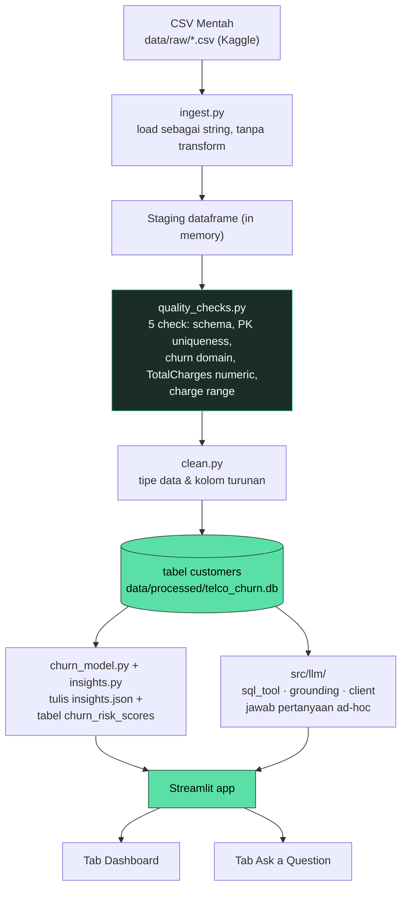

# Dokumen Arsitektur: Telco Customer Churn Analytics MVP

## 1. Problem Statement

Business user ingin tahu kenapa customer churn, segmen mana yang paling berisiko, dan mereka lebih suka tanya lanjutan dengan bahasa biasa daripada nulis SQL sendiri. MVP ini mengerjakan satu potongan kecil tapi lengkap dari kebutuhan itu: ingest dataset churn, bangun layer analytics-ready, tampilkan beberapa insight bisnis yang sudah dicek, dan biarkan orang tanya pakai bahasa natural yang jawabannya benar-benar diambil dari data itu, bukan dari pengetahuan umum LLM-nya.

## 2. Diagram Arsitektur

## 3. Data Flow

CSV mentah masuk ke staging dataframe (masih string mentah, sudah divalidasi), lalu ke tabel cleaned/curated dengan tipe data dan kolom turunan, berakhir di database SQLite yang analytics-ready. Ini varian yang lebih lengkap dari dua alur yang disebut di brief (raw, staging, transform, curated), dikerjakan pakai pandas biasa tanpa scheduler atau DAG tool, karena sumbernya cuma satu file statis dan orchestrator cuma akan jadi overhead di sini.

Data quality check jalan di staging dataframe sebelum proses cleaning, dan hasilnya ditulis ke `data/processed/quality_report.json` supaya kalau ada yang gagal kelihatan jelas, bukan diam-diam diperbaiki. Satu check yang memang diperkirakan gagal, 11 baris `TotalCharges` kosong di customer baru dengan tenure=0, ditangani di `clean.py` bukan dihapus, supaya statistik churn tidak bias ke customer yang sudah lama berlangganan.

Tiga hal yang membaca dari tabel curated ini:

1. `insights.py` jalankan 7 SQL aggregate tetap plus satu query ke hasil model, lalu simpan hasil mentah dan narasi singkat per insight ke `insights.json`. Ini yang dipakai dashboard, dan juga yang lebih dulu dicoba oleh LLM grounding layer.
2. `churn_model.py` adalah model prediktif baseline, dijalankan di antara build DB dan tahap insights (lihat bagian 5a).
3. `grounding.py` menjawab pertanyaan yang tidak ter-cover insight yang sudah dihitung, lewat tahap text-to-SQL yang dibatasi (bagian 6).

## 4. Pilihan Teknologi dan Trade-off

| Pilihan | Kenapa | Trade-off |
|---|---|---|
| Pandas untuk ingestion dan cleaning | 7K baris tidak butuh Spark atau dbt | Tidak scale ke data besar/streaming tanpa rework |
| SQLite sebagai analytics-ready store | Zero ops, berbasis file, tapi tetap kasih LLM SQL surface asli, bukan cuma dataframe | Tidak aman untuk concurrent multi-user write, tapi cukup untuk MVP yang read-mostly |
| Streamlit untuk UI | Cara tercepat dapat dashboard plus prompt box di Python | Customization terbatas, acceptable karena brief memang minta jangan terlalu polish UI |
| Precomputed insight sebagai sumber grounding utama | Angkanya divalidasi sekali lewat query yang readable, lalu dipakai ulang, jadi LLM tidak mengarang aggregate setiap kali | Cuma cover pertanyaan yang sudah dipilih duluan; pertanyaan baru jatuh ke text-to-SQL live |
| Text-to-SQL yang dibatasi untuk pertanyaan baru | Tetap grounded karena LLM cuma lihat schema dan baris hasil query, tidak pernah dibiarkan jawab bebas | Generate sekali jalan, tidak ada self-correction; query yang salah dilaporkan unanswerable bukan dicoba ulang |
| `src/llm/client.py` provider-agnostic (default OpenAI, opsional Anthropic/Gemini/Ollama) | Tidak terkunci ke satu vendor, dan dukungan Ollama bikin seluruh sistem bisa dibangun dan didemokan tanpa biaya API | Kodenya sedikit lebih banyak dibanding panggil satu SDK langsung; model lokal lebih lemah hasilkan JSON bersih untuk tahap routing |
| Tidak pakai LangChain atau agent framework sejenis | Routing dan compose cuma dua panggilan LLM polos. Framework justru nambah abstraksi tanpa nambah kapabilitas, dan menyembunyikan persis di mana validasi SQL terjadi | Lebih banyak kode plumbing dibanding SQL agent dari framework, tapi auditable baris per baris |
| scikit-learn LogisticRegression polos untuk model churn | Cepat dilatih di 7K baris dan koefisiennya bisa langsung diperiksa | Tidak ada tuning atau cross-validation, bukan skor production yang terkalibrasi; koefisiennya masih perlu dicek multicollinearity-nya dulu sebelum dipercaya (bagian 5a) |
| Setup Docker satu container, pipeline jalan saat startup | Satu `docker compose up` dan reviewer langsung punya app yang jalan tanpa environment Python lokal | Rebuild dataset curated setiap container start (di sini cuma beberapa detik, tapi tidak akan scale); bukan deployment production multi-service |

## 5. Analytics Layer

Brief minta minimal 5 pertanyaan bisnis, di sini ada 7: churn rate keseluruhan, churn by jenis kontrak, churn by tenure bucket, churn by payment method, efek add-on service seperti tech support dan online security, revenue at risk dari customer yang sudah churn, dan segmen berisiko tertinggi lengkap dengan rekomendasinya. Setiap insight menyimpan query SQL-nya bersebelahan dengan hasilnya, jadi narasi di dashboard selalu bisa ditelusuri balik ke sesuatu yang bisa diperiksa, dan pasangan yang sama ini juga dipakai ulang sebagai grounding context buat LLM.

## 5a. Model Prediksi Risiko Churn (plus point, opsional menurut brief)

Bagian 5 sifatnya murni deskriptif, menjelaskan churn yang sudah terjadi tapi tidak bisa jawab "customer aktif mana yang harus ditarget berikutnya?" Itu butuh skor yang forward-looking, jadi ada layer prediktif kecil di atas insight deskriptif, bukan menggantikannya.

**Model.** `LogisticRegression(class_weight="balanced")` di atas fitur numerik yang sudah di-scale (tenure, monthly charges, num_services) dan kategorikal yang di-one-hot-encode (contract, payment method, internet service, semua flag add-on service). Dipilih karena interpretable, dan karena 7K baris dengan ~20 fitur tidak butuh sesuatu yang lebih berat untuk dapat sinyal yang berguna.

**Evaluasi.** Satu kali stratified split 80/20, bukan k-fold, dan itu shortcut yang wajar untuk MVP 5 hari. Metrik di held-out set: accuracy 0,74, precision 0,51, recall 0,78, ROC-AUC 0,84. Recall diprioritaskan lewat `class_weight="balanced"` karena untuk use case retensi, melewatkan customer yang benar-benar akan churn itu lebih mahal dibanding salah flag orang yang sebenarnya tetap setia.

**Masalah multicollinearity yang saya temukan dan perbaiki.** Versi pertama model ini juga memasukkan `total_charges` sebagai fitur. Fitur itu berkorelasi dengan `tenure_months` di r=0,83 (total_charges kira-kira sama dengan tenure dikali monthly_charges), dan itu bikin koefisiennya sendiri keluar positif, seolah-olah "customer yang sudah bayar lebih banyak lebih mungkin churn." Itu cuma artefak korelasi, bukan sinyal asli, karena tenure_months sendiri sudah membawa efek "hubungan lebih lama, risiko lebih rendah" yang sebenarnya. Menghapus total_charges cuma menurunkan ROC-AUC sedikit (dari 0,842 ke 0,838 di tes berdampingan) dan menghilangkan koefisien yang kalau ditunjukkan ke business user justru menyesatkan. Perlu dicatat, fitur yang tersisa juga tidak benar-benar independen satu sama lain (monthly_charges, num_services, dan jenis internet_service masih berkorelasi satu sama lain di r≈0,7), jadi tanda koefisien per fitur tetap paling aman dibaca sebagai arah saja dan dicross-check ke insight deskriptif di bagian 5, bukan dianggap sebagai estimasi kausal yang berdiri sendiri.

**Explainability.** Koefisien teratas disimpan di `model_metrics.json`. Kontrak two-year dan tenure yang panjang paling menurunkan risiko; internet fiber-optic dan kontrak month-to-month paling menaikkan risiko, dan keduanya cocok dengan churn rate mentah per segmen di bagian 5 (customer fiber-optic churn di 41,9% dibanding 19,0% untuk DSL). Ada satu koefisien yang perlu dilihat lebih hati-hati, bukan langsung disimpulkan: `monthly_charges` keluar sedikit negatif begitu jenis internet dan jumlah layanan sudah ada di model, artinya di antara customer dengan jenis internet dan jumlah add-on yang sama, bayar sedikit lebih mahal berasosiasi dengan churn yang sedikit lebih rendah. Itu masuk akal (harga lama/legacy pricing, akun yang lebih lama terikat), tapi ini efek orde kedua yang menumpang di fitur-fitur yang berkorelasi, bukan sesuatu yang layak diulang ke stakeholder sebagai "menaikkan harga menurunkan churn."

**Output.** Hasil prediksi masuk ke tabel `churn_risk_scores` yang terpisah, bukan digabung ke `customers`, supaya lineage tabel curated tetap murni hasil ETL dan output model jelas bisa dilacak asalnya.

**Limitasi.** Ini baseline, bukan layanan scoring production. Tidak ada hyperparameter tuning, tidak ada monitoring drift, tidak ada jadwal retraining, dan probabilitasnya belum terkalibrasi. Modelnya cukup bagus untuk ranking risiko relatif menurut ROC-AUC, tapi jangan dibaca sebagai "customer ini punya kemungkinan churn tepat 73%."

**Threshold keputusan yang cost-sensitive.** Cutoff default 0,5 menghasilkan precision 0,51 dan recall 0,78, dan precision 0,51 itu sendirian kelihatan lemah. Daripada nge-tuning ke metrik statistik seperti F1, `churn_model.py` memilih threshold yang memaksimalkan expected net retention value dalam dolar di test set, pakai `monthly_charges` asli tiap customer dan tiga asumsi yang diungkapkan secara terbuka:

| Asumsi | Nilai | Status |
|---|---|---|
| Biaya per outreach retensi | $15/customer | Tebakan, tidak ada data biaya campaign asli untuk dataset ini |
| Retention success rate | 30% | Tebakan |
| Horizon nilai (bulan billing yang diselamatkan per customer yang berhasil di-retain) | 12 bulan | Tebakan, proxy kasar untuk sebagian dari lifetime value |

Dengan angka-angka itu, kurva net value di test set memuncak di threshold 0,1 (net value sekitar $80.731 dari 1.409 customer test), dibanding $71.145 di threshold default 0,5 dan cuma $42.288 di threshold 0,8 yang precision-nya tinggi. Alasannya, outreach itu murah dibanding nilai yang diselamatkan kalau berhasil menangkap satu customer yang benar-benar mau churn, jadi model sebaiknya menjaring lebih luas. Precision di rentang 0,3 sampai 0,5 itu titik operasi yang secara ekonomi rasional dengan biaya-biaya ini, bukan kegagalan model. Kalau nanti bisnisnya punya data biaya asli yang menunjukkan outreach itu sebenarnya mahal, misalnya diskon besar atau waktu account manager secara manual, kurva yang sama dihitung ulang dengan konstanta baru kemungkinan akan merekomendasikan threshold yang lebih tinggi. Itu yang jadi lever untuk direvisit, bukan modelnya sendiri.

## 6. LLM-Powered Prompt Interface

**Bagaimana LLM menyentuh data.** Tidak pernah secara langsung. Pertanyaan dulu lewat panggilan routing (output hanya JSON) yang pilih satu dari tiga aksi: pakai ulang insight yang sudah dihitung dan punya nama, tulis satu SELECT read-only ke `customers` dan/atau `churn_risk_scores`, atau bilang pertanyaannya tidak bisa dijawab. Di tahap ini model cuma lihat schema tabel dan katalog insight yang tersedia, tidak pernah lihat baris data mentah.

**Mengurangi hallucination.** LLM tidak bisa eksekusi apa pun sendiri. `src/llm/sql_tool.py` mengecek SQL yang dihasilkan lewat allowlist (cuma SELECT, satu statement, setiap target FROM/JOIN diparse dan dicek ke dua tabel yang dikenal, keyword DDL/DML/PRAGMA diblokir, row cap diberlakukan) sebelum dijalankan lewat koneksi SQLite read-only. Panggilan kedua baru menulis jawaban final pakai cuma baris atau teks insight yang sudah diambil, dengan instruksi bilang "tidak bisa jawab" daripada menambah fakta dari luar. Default ke insight yang sudah dihitung dan dicek sebelumnya juga berarti kebanyakan jawaban bisa ditelusuri ke query yang memang sudah pernah diperiksa orang, bukan query baru yang baru ditulis LLM saat itu.

**Bagaimana jawaban divalidasi.** Ini sifatnya struktural, bukan tahap scoring terpisah: setiap jawaban punya field `source` (`precomputed_insight`, `generated_sql`, atau `none`) dan field `detail` berisi insight id atau SQL exact yang dipakai, keduanya ditampilkan di expander "how was this generated" di UI. Belum ada automated groundedness scorer di sini, itu masuk daftar future improvement.

**Yang terjadi kalau pertanyaan tidak bisa dijawab.** Tahap routing bisa balikin `unanswerable` dengan alasan, atau jalur SQL bisa gagal validasi, gagal eksekusi, atau balik dengan nol baris. Ketiga kasus ini menampilkan warning biasa, bukan jawaban yang dikarang.

**Security dan privacy.** Dataset ini tidak punya PII asli (`customer_id` sudah jadi key yang anonim), tapi SQL tool tetap dibatasi ke tabel yang dikenal dan mode read-only sebagai lapisan pertahanan kedua, karena versi production kemungkinan punya identifier asli. SQL yang dihasilkan LLM adalah risiko utama mirip injection di desain ini, ditangani lewat allowlist dan koneksi read-only, bukan dengan percaya begitu saja pada penilaian model sendiri soal apa yang aman. API key disimpan di `.env` yang di-gitignore dan tidak pernah di-log, dan tidak ada konten request/response yang disimpan. Tidak ada rate limiting atau auth per-user di Streamlit app, yang masih wajar untuk demo lokal tapi memang secara eksplisit disebut belum production-ready (bagian 7). Menjalankan dengan `LLM_PROVIDER=ollama` bikin pertanyaan dan baris data yang diambil tetap sepenuhnya di device sendiri, tanpa panggilan API pihak ketiga sama sekali, yang jadi keuntungan privacy nyata kalau data di belakangnya sensitif, dengan trade-off kualitas jawaban lebih lemah dan output JSON kurang reliable dibanding model hosted.

**Di luar alur minimum.** Ada dua tambahan kecil di atas grounding tiga-panggilan di atas, keduanya opt-in extra bukan bagian inti dari desainnya. Pertama, kalau baris di balik jawaban yang grounded punya lebih dari satu baris dan ada kolom numerik, UI menampilkan bar chart cepat di samping jawaban teksnya, tanpa panggilan LLM tambahan, cuma cek bentuk data yang sudah diambil. Kedua, ada panggilan saran follow-up yang mengusulkan 2-3 pertanyaan lanjutan berdasarkan jawaban yang baru diberikan. Panggilan saran ini satu-satunya bagian yang desainnya belum sepenuhnya grounded: diminta tetap di dalam apa yang bisa dijawab dataset ini, tapi model lokal yang kecil kadang mengusulkan sesuatu yang sebenarnya tidak ada di tabel (rentang tanggal, region). Itu soft failure mode, bukan risiko hallucination ke user, karena klik saran yang salah cuma masuk lagi ke tahap routing di atas dan balik dengan "unanswerable" bukan mengarang jawaban untuk itu.

## 7. Apa yang Ada di MVP vs. yang Belum Production-Ready

Sudah ada: pipeline lengkap dari CSV mentah sampai SQLite curated, data quality check yang terdokumentasi, 7 insight precomputed plus layer prediktif, dashboard, prompt interface yang grounded dengan routing tiga arah dan jejak yang kelihatan soal bagaimana tiap jawaban dihasilkan, auto-generated chart dan follow-up suggestion di atas itu semua, dan setup Dockerfile/compose yang jalankan seluruh pipeline dan app dalam satu container.

Belum production-ready: tidak ada authentication, multi-tenancy, atau rate limiting; tidak ada automated regression suite untuk kualitas jawaban; tidak ada incremental ingestion, ini full rebuild dari satu snapshot CSV setiap kali jalan; tidak ada retry loop untuk SQL yang gagal dihasilkan; SQLite tidak dibuat untuk concurrent multi-user write (masih acceptable di sini karena sifatnya read-mostly); tidak ada logging atau observability untuk panggilan LLM selain yang kelihatan di UI; setup Docker-nya single-container dan rebuild dataset setiap kali start, bukan dipersist antar deploy.

## 8. Rencana Improvement

1. Bangun set kecil pasangan pertanyaan/jawaban yang sudah berlabel untuk menangkap regresi di routing atau SQL generation.
2. Tambahkan tahap retry untuk SQL generation, tunjukkan error SQLite yang asli ke LLM dan biarkan coba sekali lagi sebelum langsung declare unanswerable.
3. Pindahkan curated layer ke Postgres atau DuckDB kalau volume data atau concurrent access bertambah, tetap pakai pola allowlist yang sama di `sql_tool.py`.
4. Tambahkan masking atau access control level kolom kalau nanti ada kolom PII asli yang masuk.
5. Kalibrasi dan cross-validation yang proper untuk model churn-nya (Platt scaling, k-fold, split berbasis waktu kalau ada data multi-periode) sebelum `churn_probability` dipakai untuk keputusan budget retensi yang sungguhan.
6. Pindah dari satu container Docker ke setup yang mempersist database hasil build antar deploy, bukan rebuild setiap container start, dan pisahkan pipeline dari app service kalau nanti perlu jalan terjadwal.
